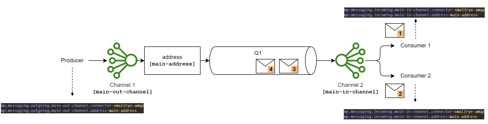
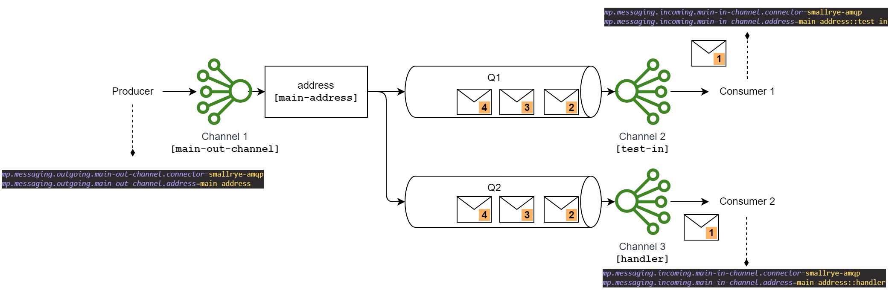

# CQRS POC Project
## What's the purpose ?
The purpose of this project is to demonstrate how **CQRS** (**C**ommand **Q**uery **R**esponsibility **S**egregation).
The case study here is the management of a gym.

To work, this project use :
- **Quarkus**, the Supersonic Subatomic Java Framework ;
- **Active MQ**, an open source message broker ;
- **PostgreSQL**, an open source relational database ;
- **MongoDB**, a documents oriented database.

For practical reasons, an [**NGINX**](#active-mq) (as Reverse Proxy) may be mandatory to access Active MQ GUI if used through containers (CORS constraints).

## Architecture
:construction: _**TODO**_ :construction:
# How to
## Build/Use Quarkus 
### Running the application in dev mode

You can run your application in dev mode that enables live coding using:
```shell script
./mvnw compile quarkus:dev
```

> **_NOTE:_**  Quarkus now ships with a Dev UI, which is available in dev mode only at http://localhost:8080/q/dev/.

### Packaging and running the application

The application can be packaged using:
```shell script
./mvnw package
```
It produces the `quarkus-run.jar` file in the `target/quarkus-app/` directory.
Be aware that it’s not an _über-jar_ as the dependencies are copied into the `target/quarkus-app/lib/` directory.

The application is now runnable using `java -jar target/quarkus-app/quarkus-run.jar`.

If you want to build an _über-jar_, execute the following command:
```shell script
./mvnw package -Dquarkus.package.type=uber-jar
```

The application, packaged as an _über-jar_, is now runnable using `java -jar target/*-runner.jar`.

### Creating a native executable

You can create a native executable using:
```shell script
./mvnw package -Pnative
```

Or, if you don't have GraalVM installed, you can run the native executable build in a container using:
```shell script
./mvnw package -Pnative -Dquarkus.native.container-build=true
```

You can then execute your native executable with: `./target/code-with-quarkus-1.0.0-SNAPSHOT-runner`

If you want to learn more about building native executables, please consult https://quarkus.io/guides/maven-tooling.
#Issues
We encountered an issue concerning the message consumption in the event handler. This issue seems to be an ActiveMQ error : "The overflow buffer is full, which is due to the upstream sending too many items w.r.t. the downstream capacity and/or the downstream not consuming items fast enough"
After restarting the services, the error is gone...
## Active MQ 
> Console URL (through nginx reverse proxy ) at http://localhost:8090/console/auth/login (see [Docker compose file](./docker/docker-compose.yml))

### Properties
Here is the description of how Active MQ works with AMQP protocol when the need is anycasting or multicasting messages.
#### AMQ ANYCAST

```properties
mp.messaging.outgoing.main-out-channel.connector=smallrye-amqp
mp.messaging.outgoing.main-out-channel.address=main-address
```
```properties
mp.messaging.incoming.main-in-channel.connector=smallrye-amqp
mp.messaging.incoming.main-in-channel.address=main-address
```

#### AMQ MULTICAST

```properties
mp.messaging.outgoing.main-out-channel.connector=smallrye-amqp
mp.messaging.outgoing.main-out-channel.address=main-address
```
```properties
mp.messaging.incoming.main-in-channel.connector=smallrye-amqp
mp.messaging.incoming.main-in-channel.address=main-address::test-in
```
```properties
mp.messaging.incoming.main-in-channel.connector=smallrye-amqp
mp.messaging.incoming.main-in-channel.address=main-address::handler
```